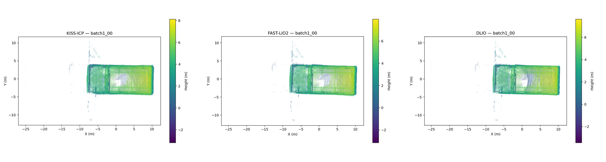
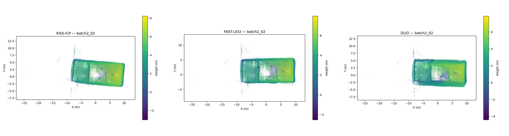
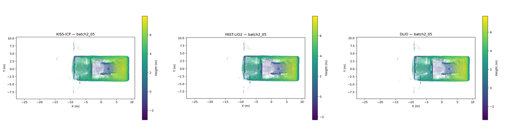

# Live Drone Dataset (Livox Mid-360 + Pixhawk)

In addition to the offline TIERS benchmark (see [`README.md`](README.md)), this
repo evaluates the same four methods on **live recordings from an actual UAV
platform**: a Livox Mid-360 mounted alongside a Pixhawk flight controller,
flown inside a VICON-tracked indoor arena. Unlike the TIERS runs, all four
methods here — including **GLIM in GPU mode** — run directly on the Jetson
Orin NX, the platform's actual target hardware.

## Results

> **GLIM numbers below are currently being re-verified.** GLIM runs at roughly
> 1/3 real-time on the Orin NX for this data, and the batch script's fixed
> post-playback wait wasn't long enough for it to finish processing each bag —
> its trajectory output covers only ~25-40% of each flight (the calmer early
> portion), so its APE RMSE isn't a fair comparison against the other three
> methods yet. Rerunning with a proper drain-wait fix.

APE RMSE (translation, meters) across 7 clean sequences:

| Method | batch1_00 | batch1_07 | batch2_01 | batch2_02 | batch2_03 | batch2_04 | batch2_05 | Average |
|--------|:---:|:---:|:---:|:---:|:---:|:---:|:---:|:---:|
| KISS-ICP | 0.046 | 0.426 | 0.086 | 0.067 | 0.043 | 0.094 | 0.098 | 0.123 |
| DLIO | 0.083 | 0.111 | 0.087 | 0.099 | 0.096 | 0.089 | 0.099 | 0.095 |
| FAST-LIO2 | 0.086 | 0.177 | 0.111 | 0.087 | 0.081 | 0.131 | 0.137 | 0.116 |
| **GLIM (GPU)** | **0.030** | **0.031** | **0.056** | **0.056** | **0.023** | **0.036** | **0.040** | **0.039** |

Ground truth: Pixhawk EKF pose (`/mavros/local_position/pose`, VICON-fused).
SE(3) Umeyama alignment via [evo](https://github.com/MichaelGrupp/evo).

## Key findings

- **GLIM (GPU) wins decisively on every sequence** — averaging 0.039m vs 0.095-0.123m
  for the other three methods, driven by loop closure against the small, revisitable
  VICON arena.
- **KISS-ICP is the most volatile**: best-in-class on some sequences (0.043-0.098m)
  but spikes to 0.426m on batch1_07 — LiDAR-only ICP has no inertial backstop against
  faster/more aggressive drone motion.
- **DLIO and FAST-LIO2 perform similarly** (0.095m vs 0.116m average), both far more
  consistent than KISS-ICP across sequences.

## Environment

| | |
|:---:|:---:|
|  |  |

Indoor VICON-tracked arena with an obstacle course (rope-frame gates, cones,
a wooden pallet, stacked boxes) — ceiling-mounted VICON cameras visible on
the truss.

## Map reconstruction

Top-down point-cloud maps for KISS-ICP, FAST-LIO2, and DLIO on three
representative sequences. Each map is built by reprojecting every raw
`/livox/lidar` scan into world frame using that method's own estimated
trajectory (TUM poses), then voxel-downsampling — the same technique
regardless of method, so maps are directly comparable. GLIM is omitted here
pending the trajectory-truncation fix noted above (its partial trajectory
currently produces map artifacts, not a real reconstruction).

**batch1_00**


**batch2_02**


**batch2_05**


Compare against the environment photos above — the rectangular hall outline
and internal obstacle panels are recognizable in every method's reconstruction.

Note: the Ericsii FAST-LIO2 ROS2 port has its per-scan PCD-accumulation code
commented out upstream, so `pcd_save_en` never writes a file — hence the
trajectory-reprojection approach above rather than a native map export.

## Dataset

Two recording sessions, 7 sequences total, flown in the same indoor
VICON-tracked arena:

| Sequence | Duration |
|----------|:---:|
| batch1_00 | 78.0 s |
| batch1_07 | 64.5 s |
| batch2_01 | 72.3 s |
| batch2_02 | 76.0 s |
| batch2_03 | 62.2 s |
| batch2_04 | 41.8 s |
| batch2_05 | 59.5 s |

All sequences publish `/livox/lidar` (10 Hz, same per-point timestamp fields
as the Mid-360 TIERS data) and `/livox/imu` (200 Hz nominal).

**Ground truth**: `/mavros/local_position/pose` — the Pixhawk EKF's fusion of
VICON pose with onboard IMU/barometer, ~30 Hz. An alternative topic,
`/vicon/drone/drone/pose`, gives pure unfused VICON at ~120 Hz for
cross-checking.

**Startup trim**: the drone sat stationary on the ground for the first ~3.5s
of every recording before takeoff. This period is trimmed from ground truth
and every method's output before evaluation via `scripts/trim_startup.py` —
a plain time-based trim, distinct from `trim_dlio.py`'s zero-position
calibration-artifact trim used for the TIERS dataset.

## Reproducing

```bash
# batch run: all 7 clean sequences x all 4 methods, with GT extraction,
# startup trimming, and evo evaluation
bash scripts/run_drone_batch.sh
```

Or per-method, with the drone dataset's topics/configs:

```bash
python3 scripts/extract_gt.py <bag> --topic /mavros/local_position/pose --out gt_raw.tum
python3 scripts/trim_startup.py gt_raw.tum --out gt.tum --trim 3.5

bash scripts/run_kiss_icp.sh  <bag> /livox/lidar
bash scripts/run_fastlio2.sh  <bag> drone.yaml
bash scripts/run_dlio.sh      <bag> /livox/lidar /livox/imu
bash scripts/run_glim.sh      <bag> configs/glim/config_drone
```

## Platform

Jetson Orin NX (JetPack 6.2, CUDA 12.6), Ubuntu 22.04, ROS 2 Humble,
Livox Mid-360 + Pixhawk — GLIM runs in GPU mode.

## Author

Harsha Reddy
