# Livox Mid-360 SLAM Evaluation

Benchmarking LiDAR and LiDAR-inertial odometry/SLAM methods on the
[TIERS Multi-Modal LiDAR Dataset](https://github.com/TIERS/multi_modal_lidar_dataset),
evaluated against motion-capture (indoor) and GNSS-RTK (outdoor) ground truth.
Targets a **Jetson Orin NX + Livox Mid-360** UAV navigation platform.

## Results

APE RMSE (translation, meters) across three sequences, Mid-360 sensor:

| Method | IndoorOffice1 | IndoorOffice2 | OutdoorRoad | Average |
|--------|:---:|:---:|:---:|:---:|
| KISS-ICP | 0.124 | 0.079 | 0.089 | 0.097 |
| DLIO | 0.144 | 0.107 | N/A* | – |
| FAST-LIO2 | 0.060 | 0.049 | 0.091 | **0.067** |
| **GLIM** | **0.025** | 0.096 | 0.087 | 0.069 |

> *DLIO outdoor trajectory degenerate (duplicate poses); under investigation.

Ground truth: OptiTrack/VRPN mocap (indoor), GNSS-RTK converted to local ENU (outdoor).
SE(3) Umeyama alignment via [evo](https://github.com/MichaelGrupp/evo).

## Key findings

- **Indoors**: GLIM's loop closure gives a clear advantage (0.025 m vs 0.060 m FAST-LIO2 vs 0.124 m KISS-ICP)
- **Outdoors**: all methods converge to ~0.087–0.104 m — rich outdoor geometry makes LiDAR-only ICP competitive with LIO
- **FAST-LIO2 is most consistent** across environments (0.049–0.091 m)
- **DLIO performs similarly to KISS-ICP** on slow quadruped motion — continuous-time advantage not significant at low speeds; expected to improve on aggressive UAV motion on the Orin NX
- **GLIM's advantage is environment-dependent**: significant indoors with loop closure, marginal outdoors on CPU

## Trajectory plots

### IndoorOffice1
| KISS-ICP | DLIO |
|:---:|:---:|
| 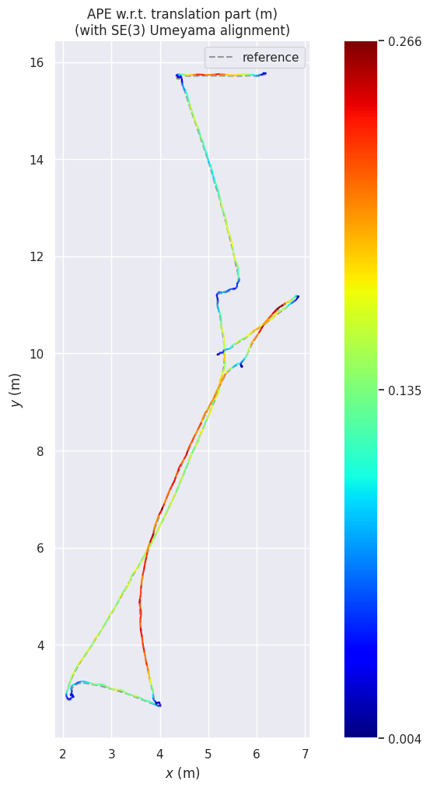 |  |

| FAST-LIO2 | GLIM |
|:---:|:---:|
| 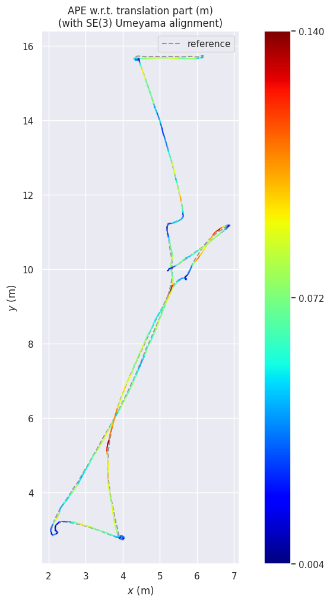 | 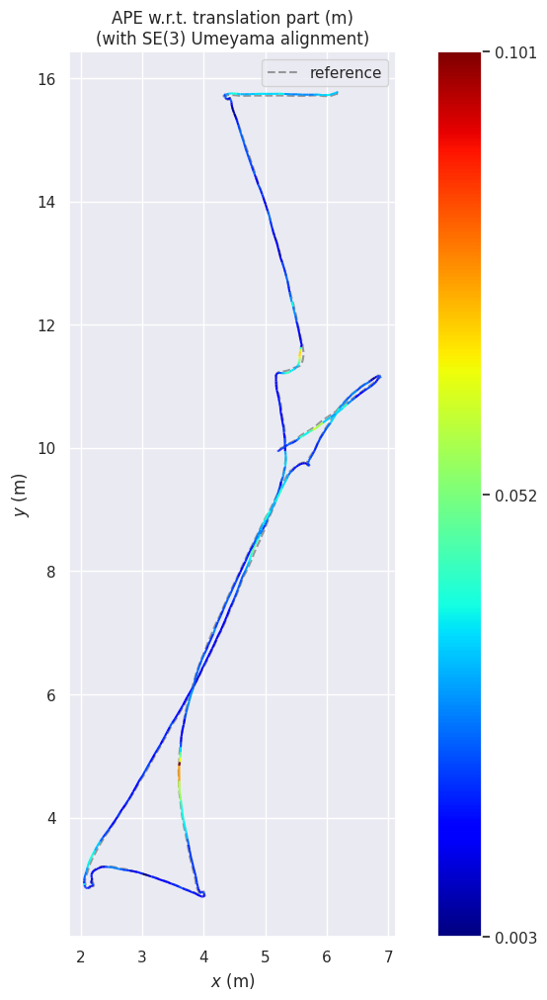 |

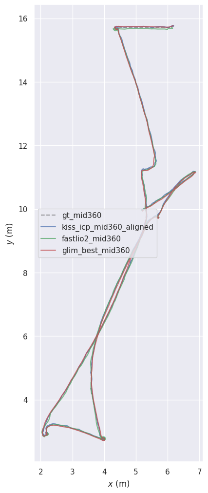

### IndoorOffice2
| KISS-ICP | DLIO |
|:---:|:---:|
| 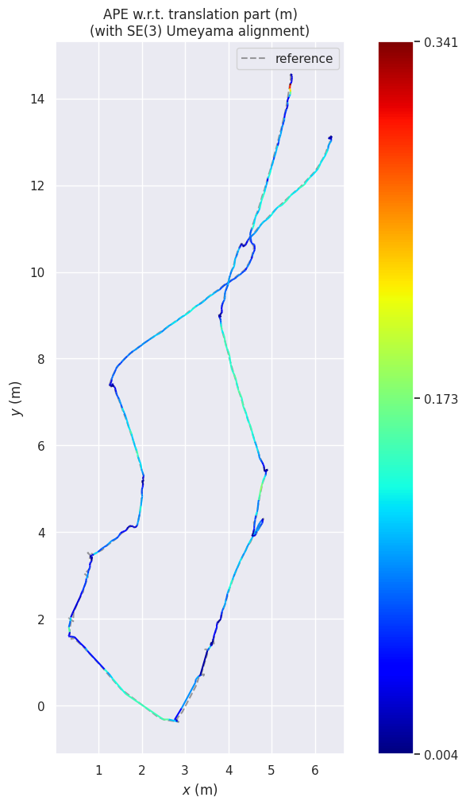 |  |

| FAST-LIO2 | GLIM |
|:---:|:---:|
| 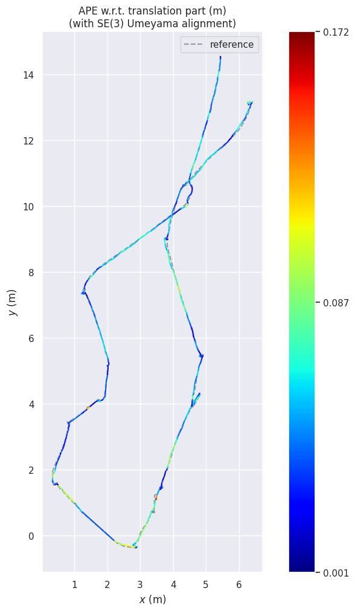 | 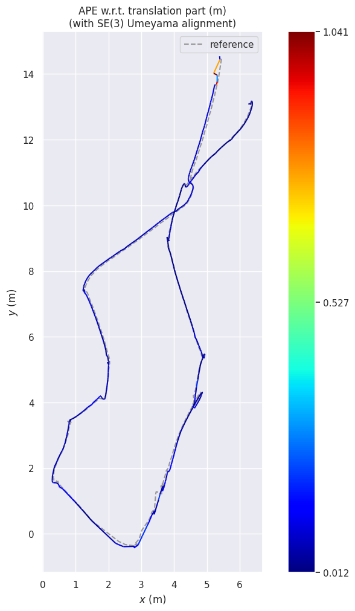 |

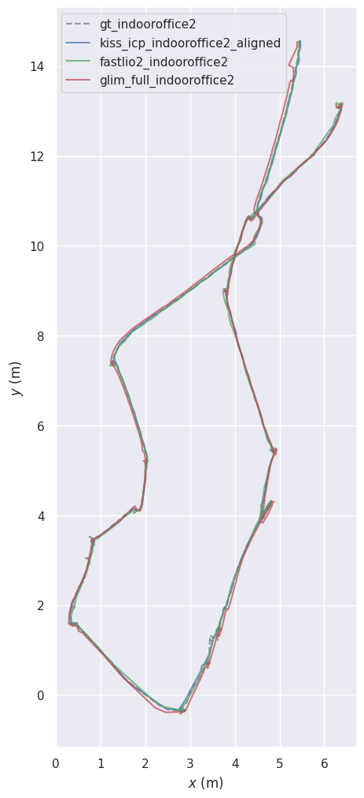

### OutdoorRoad
| KISS-ICP | DLIO |
|:---:|:---:|
|  | 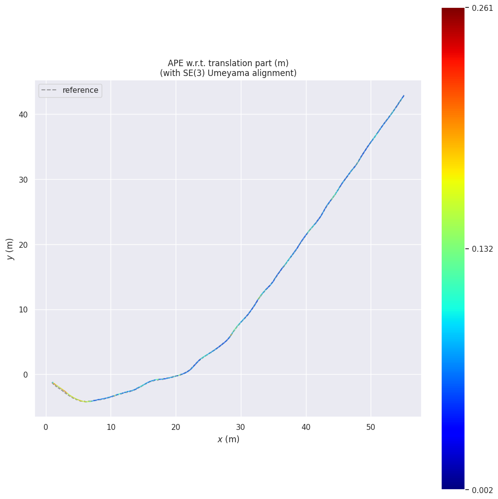 |

| FAST-LIO2 | GLIM |
|:---:|:---:|
| 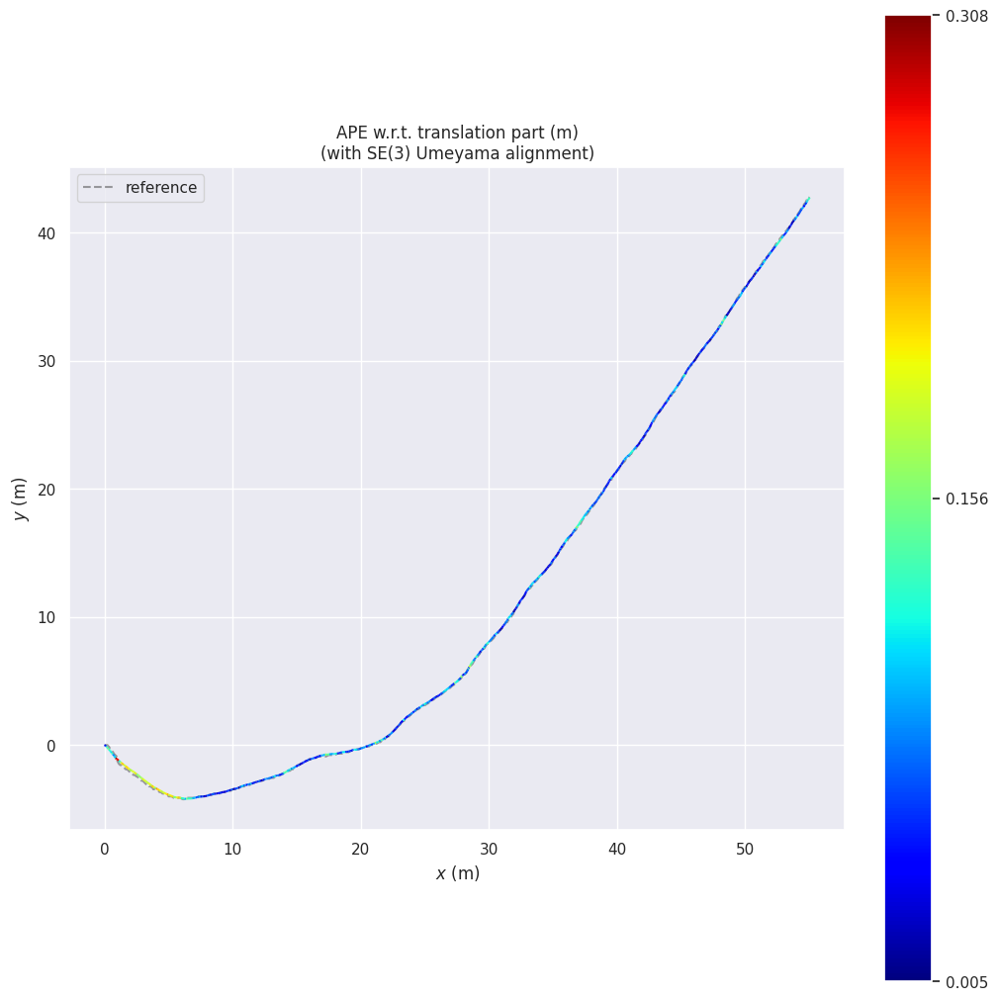 |  |

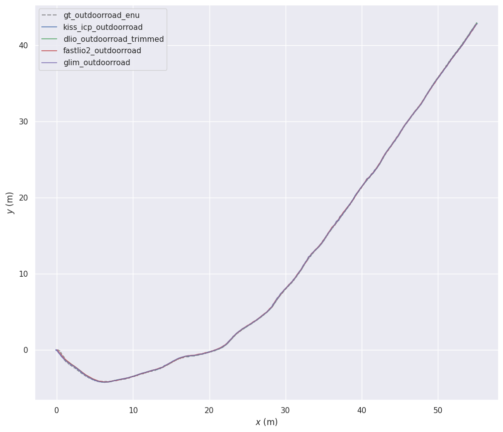

## Dataset

TIERS Multi-Modal LiDAR Dataset sequences used:

| Sequence | Environment | Duration | Ground truth |
|----------|-------------|----------|--------------|
| IndoorOffice1 | Indoor office | 66 s | OptiTrack mocap |
| IndoorOffice2 | Indoor office | 95 s | OptiTrack mocap |
| OutdoorRoad (cut0) | Outdoor road | 66 s | GNSS-RTK → local ENU |

All sequences use the **Mid-360** streams (`/mid360/livox/lidar`, `/mid360/livox/imu`).
See [`data/README.md`](data/README.md) for download and conversion steps.

## Methods

- **[KISS-ICP](https://github.com/PRBonn/kiss-icp)** — LiDAR-only odometry. Robust baseline.
- **[DLIO](https://github.com/vectr-ucla/direct_lidar_inertial_odometry)** — continuous-time LiDAR-inertial odometry (ICRA 2023). 6-axis IMU compatible.
- **[FAST-LIO2](https://github.com/Ericsii/FAST_LIO_ROS2)** — tightly-coupled LiDAR-inertial odometry (iEKF).
- **[GLIM](https://github.com/koide3/glim)** — LiDAR-inertial SLAM with factor-graph optimization and loop closure. CPU build on dev machine; GPU on Orin NX.

## Methods attempted but incompatible

**LIO-SAM** requires a 9-axis IMU. The Livox Mid-360's built-in IMU is 6-axis only,
causing complete divergence (APE RMSE ~328 m). FAST-LIO2 or GLIM are the appropriate
LiDAR-inertial methods for the Mid-360.

## Reproducing

```bash
pip install kiss-icp evo rosbags

# indoor
python3 scripts/extract_gt.py <bag> \
  --topic /vrpn_client_node/unitree_b1/pose --out results/gt.tum

# outdoor (GNSS -> ENU)
python3 scripts/extract_gt.py <bag> --topic /gnss_pose --out results/gt_raw.tum
python3 scripts/convert_gnss_to_enu.py results/gt_raw.tum --out results/gt_enu.tum

bash scripts/run_kiss_icp.sh <bag>
bash scripts/run_dlio.sh <bag>
bash scripts/run_fastlio2.sh <bag>
bash scripts/run_glim.sh <bag>
bash scripts/evaluate.sh
```

See [`docs/setup.md`](docs/setup.md) for build instructions and
[`docs/workflow.md`](docs/workflow.md) for the conceptual walkthrough.

## Evaluation notes

- Per-point timestamps lost in initial ROS1→ROS2 conversion; `rosbags-convert` recovers them.
- Indoor/LiDAR clock offset handled per-method in evaluation.
- Outdoor GNSS-RTK coordinates converted to local ENU via `scripts/convert_gnss_to_enu.py`.
- GLIM runs CPU-only on dev machine; GPU mode on Orin NX expected to improve results.
- DLIO publishes odometry at IMU rate (~200 Hz) vs LiDAR rate (10 Hz) for other methods.

## Platform

Dev: Ubuntu 22.04, ROS 2 Humble, x86\_64 (Intel iGPU).
Target: Jetson Orin NX, Ubuntu 22.04, ROS 2 Humble, Livox Mid-360.

## Author

Harsha Reddy
