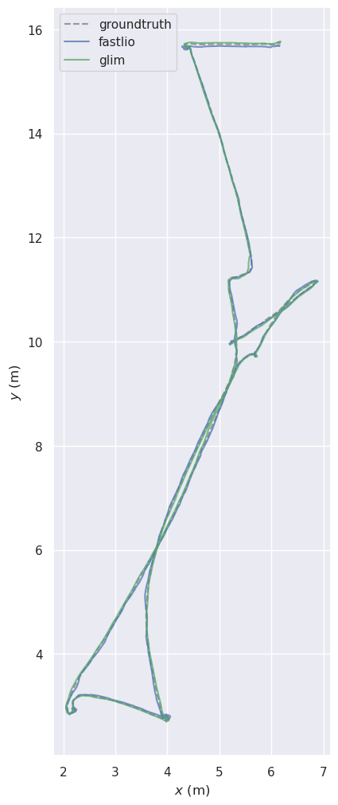

# SLAM Benchmark: FAST-LIO vs GLIM (Livox MID360)

This repository presents a **clean, reproducible benchmark comparison** between two LiDAR-Inertial SLAM systems:

- **FAST-LIO** (Kalman filter-based tightly coupled LIO)
- **GLIM** (Graph-based LiDAR-Inertial Mapping)

Evaluation is performed on **Livox MID360 Indoor Office dataset** using ROS2 and EVO trajectory analysis.

---

# Objective

The goal of this work is to:

- Compare **accuracy and drift behavior** of FAST-LIO vs GLIM
- Evaluate performance on **real-world Livox MID360 data**
- Provide **quantitative + visual SLAM benchmarking**
- Ensure reproducibility using open-source tools

---

# Main Result (Trajectory Comparison)

### XY Plane Trajectory Overlay

This is the final aligned trajectory comparison:

---

# Quantitative Evaluation

Metrics computed using EVO:

| Method     | APE RMSE (m) | RPE RMSE (m) |
|------------|--------------|--------------|
| FAST-LIO   | 0.0602       | 0.1133       |
| GLIM       | **0.0252**   | 0.1101       |

---

# System Setup & Modifications

To enable both systems on **Livox MID360**, the following adaptations were required:

---

## FAST-LIO Modifications

- Adjusted IMU scaling for Livox MID360 sensor
- Updated ROS2 topic mapping:
  - `/mid360/livox/lidar`
  - `/mid360/livox/imu`
- Fixed timestamp synchronization issues
- Ensured correct scan integration for LiDAR-inertial fusion

---

## GLIM Modifications

- Configured correct sensor topics in ROS2
- Fixed odometry module loading issues
- Resolved Livox float64 timestamp interpretation
- Adjusted dynamic library loading (`gtsam_points`, `gtsam`)
- Fixed viewer module dependencies (`rviz_viewer`, `memory_monitor`)

---

# Key Findings

- **GLIM achieves lower global drift (better APE score)**
- FAST-LIO shows stable short-term tracking performance
- Both methods have similar local accuracy (RPE close)
- Graph-based optimization improves long-term consistency (GLIM)

---

# Tools Used

- ROS2 Humble
- EVO trajectory evaluation toolkit
- Livox MID360 LiDAR dataset
- Python (trajectory parsing & evaluation)

---

# References

- FAST-LIO: https://github.com/hku-mars/FAST_LIO
- GLIM: https://github.com/koide3/glim
- EVO: https://github.com/MichaelGrupp/evo

---

# Notes

- All results are reproducible using ROS2 bags
- Trajectories are aligned using Umeyama SE(3) alignment
- Ground truth obtained from motion capture system (VRPN)

---

# Summary

This repository serves as a **SLAM benchmarking study**, focusing on:

> ✔ Accuracy comparison  
> ✔ Drift analysis  
> ✔ Real-world sensor evaluation (Livox MID360)  
