# Livox Mid-360 SLAM Evaluation

Benchmarking LiDAR and LiDAR-inertial odometry/SLAM methods on the
[TIERS Multi-Modal LiDAR Dataset](https://github.com/TIERS/multi_modal_lidar_dataset),
evaluated against motion-capture (indoor) and GNSS-RTK (outdoor) ground truth.
Targets a **Jetson Orin NX + Livox Mid-360** UAV navigation platform.

## Results

APE RMSE (translation, meters) across three sequences, Mid-360 sensor:

| Method | IndoorOffice1 | IndoorOffice2 | OutdoorRoad | Average |
|--------|:---:|:---:|:---:|:---:|
| KISS-ICP | 0.124 | 0.079 | 0.089 | 0.097 |
| DLIO | 0.075 | 0.073 | 0.090 | 0.079 |
| FAST-LIO2 | 0.060 | 0.049 | 0.091 | **0.067** |
| **GLIM** | **0.025** | 0.096 | 0.087 | 0.069 |

Ground truth: OptiTrack/VRPN mocap (indoor), GNSS-RTK converted to local ENU (outdoor).
SE(3) Umeyama alignment via [evo](https://github.com/MichaelGrupp/evo).

## Key findings

- **Indoors**: GLIM's loop closure gives a clear advantage (0.025 m vs 0.060 m FAST-LIO2 vs 0.124 m KISS-ICP)
- **Outdoors**: all methods converge to ~0.087–0.104 m — rich outdoor geometry makes LiDAR-only ICP competitive with LIO
- **FAST-LIO2 is most consistent** across environments (0.049–0.091 m)
- **DLIO performs similarly to KISS-ICP** on slow quadruped motion — continuous-time advantage not significant at low speeds; expected to improve on aggressive UAV motion on the Orin NX
- **GLIM's advantage is environment-dependent**: significant indoors with loop closure, marginal outdoors on CPU

## Trajectory plots

### IndoorOffice1
| KISS-ICP | DLIO |
|:---:|:---:|
| 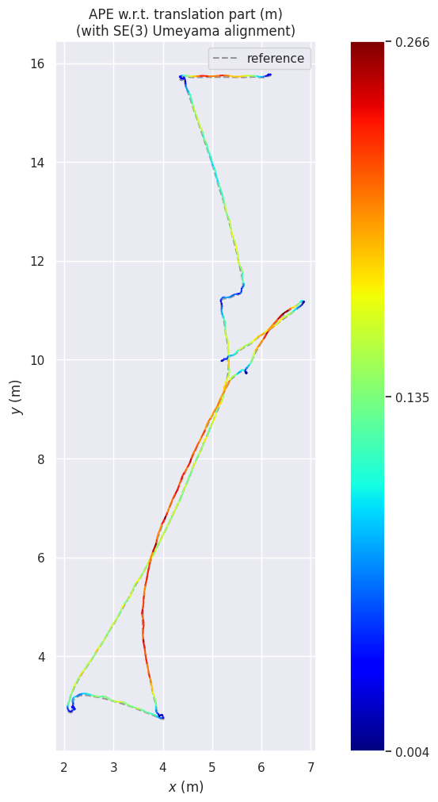 |  |

| FAST-LIO2 | GLIM |
|:---:|:---:|
| 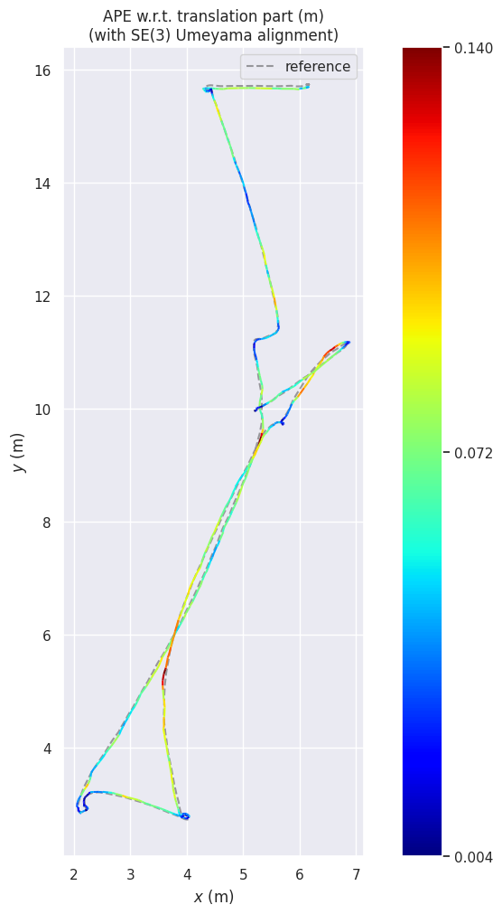 | 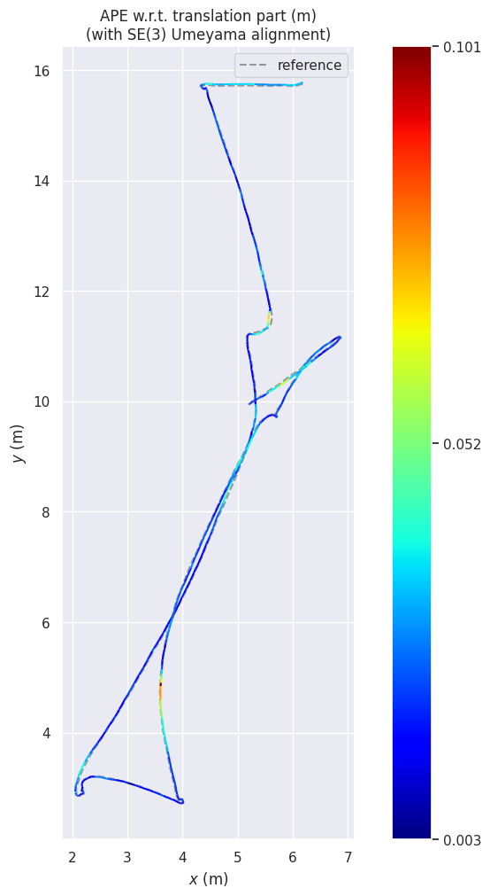 |

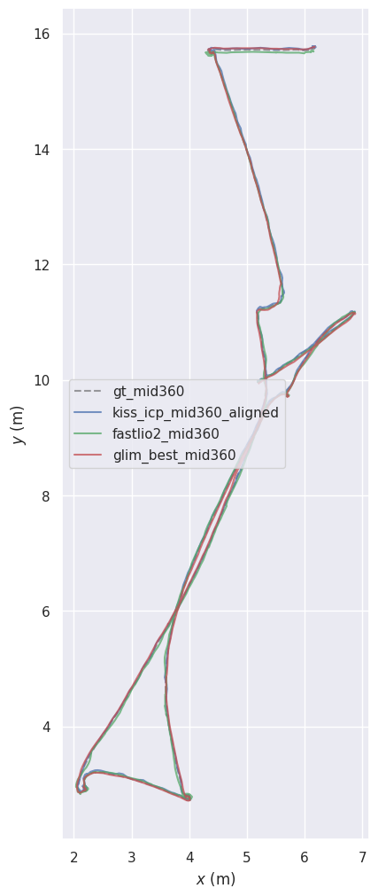

### IndoorOffice2
| KISS-ICP | DLIO |
|:---:|:---:|
| 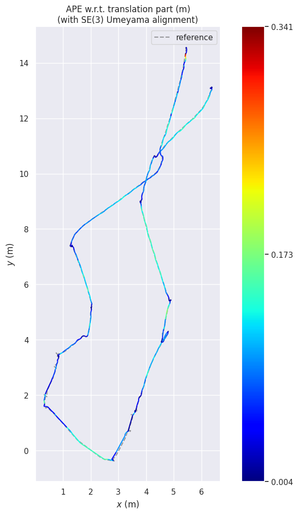 |  |

| FAST-LIO2 | GLIM |
|:---:|:---:|
| 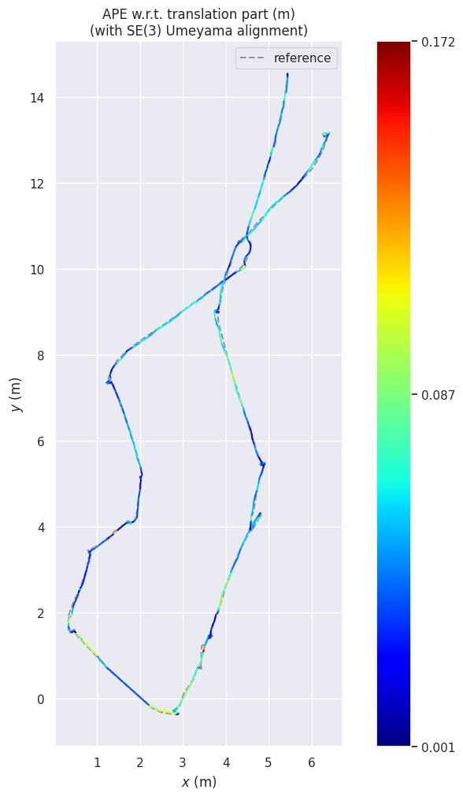 | 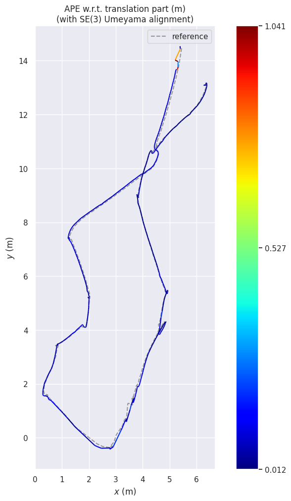 |

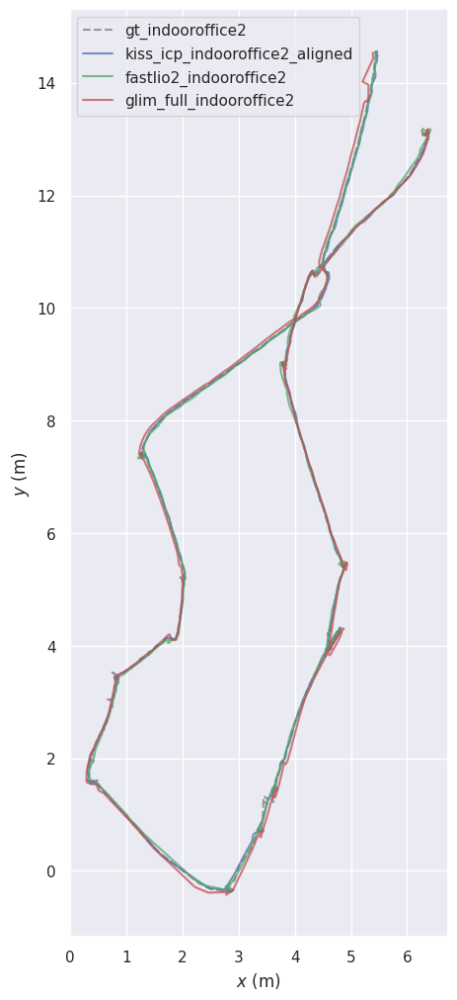

### OutdoorRoad
| KISS-ICP | DLIO |
|:---:|:---:|
|  | 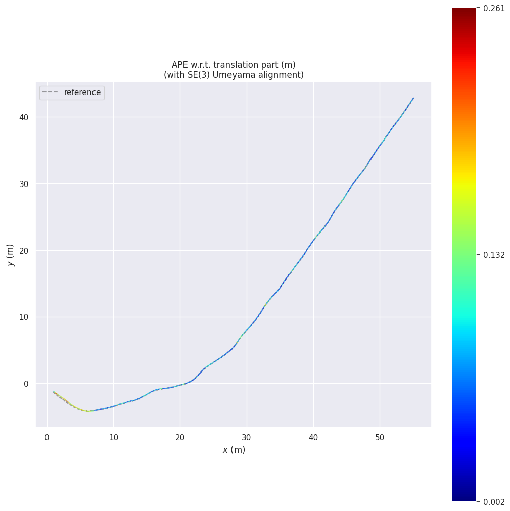 |

| FAST-LIO2 | GLIM |
|:---:|:---:|
| 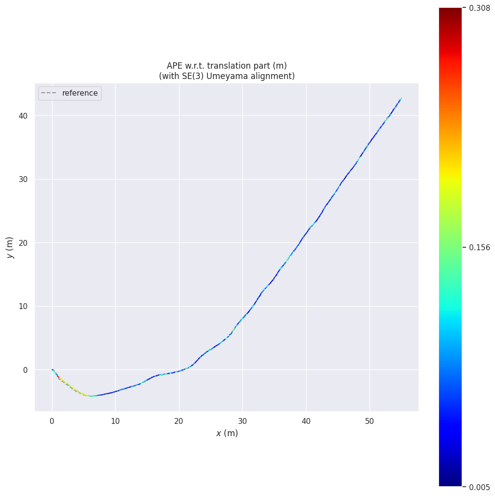 |  |

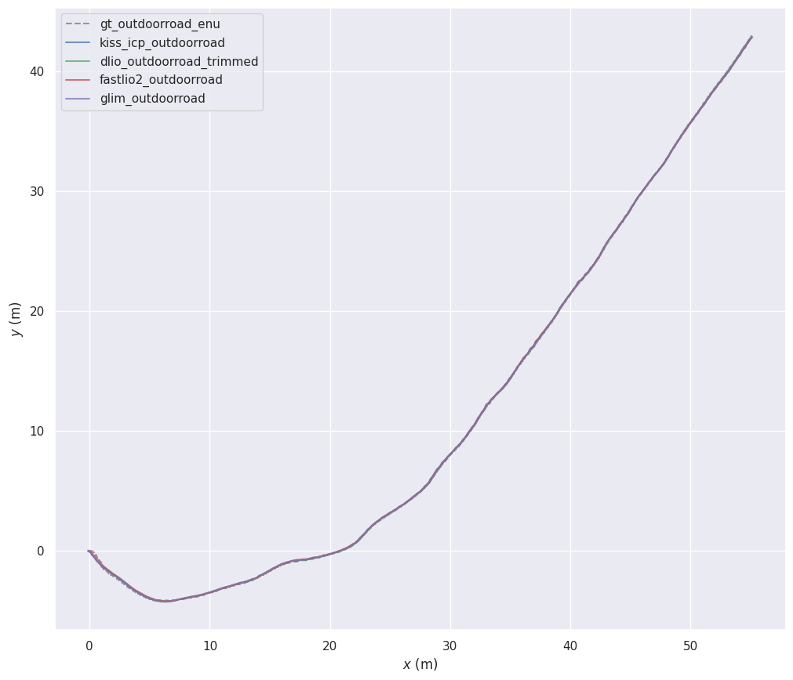

## Dataset

TIERS Multi-Modal LiDAR Dataset sequences used:

| Sequence | Environment | Duration | Ground truth |
|----------|-------------|----------|--------------|
| IndoorOffice1 | Indoor office | 66 s | OptiTrack mocap |
| IndoorOffice2 | Indoor office | 95 s | OptiTrack mocap |
| OutdoorRoad (cut0) | Outdoor road | 66 s | GNSS-RTK → local ENU |

All sequences use the **Mid-360** streams (`/mid360/livox/lidar`, `/mid360/livox/imu`).
See [`data/README.md`](data/README.md) for download and conversion steps.

## Methods

- **[KISS-ICP](https://github.com/PRBonn/kiss-icp)** — LiDAR-only odometry. Robust baseline.
- **[DLIO](https://github.com/vectr-ucla/direct_lidar_inertial_odometry)** — continuous-time LiDAR-inertial odometry (ICRA 2023). 6-axis IMU compatible.
- **[FAST-LIO2](https://github.com/Ericsii/FAST_LIO_ROS2)** — tightly-coupled LiDAR-inertial odometry (iEKF).
- **[GLIM](https://github.com/koide3/glim)** — LiDAR-inertial SLAM with factor-graph optimization and loop closure. CPU build on dev machine; GPU on Orin NX.

## Methods attempted but incompatible

**LIO-SAM** requires a 9-axis IMU. The Livox Mid-360's built-in IMU is 6-axis only,
causing complete divergence (APE RMSE ~328 m). FAST-LIO2 or GLIM are the appropriate
LiDAR-inertial methods for the Mid-360.

## Reproducing

```bash
pip install kiss-icp evo rosbags

# indoor
python3 scripts/extract_gt.py <bag> \
  --topic /vrpn_client_node/unitree_b1/pose --out results/gt.tum

# outdoor (GNSS -> ENU)
python3 scripts/extract_gt.py <bag> --topic /gnss_pose --out results/gt_raw.tum
python3 scripts/convert_gnss_to_enu.py results/gt_raw.tum --out results/gt_enu.tum

bash scripts/run_kiss_icp.sh <bag>
bash scripts/run_dlio.sh <bag>
bash scripts/run_fastlio2.sh <bag>
bash scripts/run_glim.sh <bag>
bash scripts/evaluate.sh
```

See [`docs/setup.md`](docs/setup.md) for build instructions and
[`docs/workflow.md`](docs/workflow.md) for the conceptual walkthrough.

## Evaluation notes

- Per-point timestamps lost in initial ROS1→ROS2 conversion; `rosbags-convert` recovers them.
- Indoor/LiDAR clock offset handled per-method in evaluation.
- Outdoor GNSS-RTK coordinates converted to local ENU via `scripts/convert_gnss_to_enu.py`.
- GLIM runs CPU-only on dev machine; GPU mode on Orin NX expected to improve results.
- **DLIO startup trimming:** DLIO performs a 3-second IMU calibration at node startup before processing the first scan. During this period it publishes poses at the origin (0,0,0), which artificially inflates APE RMSE (0.144m → 0.075m on IndoorOffice1 when trimmed). These zero-position startup poses are stripped before evaluation using `scripts/trim_dlio.py`. On live hardware (Orin NX), the calibration happens before the robot starts moving so this artifact does not occur.
- DLIO publishes odometry at IMU rate (~200 Hz) vs LiDAR rate (10 Hz) for other methods.

## Live Drone Dataset (Livox Mid-360 + Pixhawk)

In addition to the offline TIERS benchmark above, this repo evaluates the same
four methods on **live recordings from an actual UAV platform**: a Livox
Mid-360 mounted alongside a Pixhawk flight controller, flown inside a
VICON-tracked indoor arena. Unlike the TIERS runs, all four methods here —
including **GLIM in GPU mode** — run directly on the Jetson Orin NX, the
platform's actual target hardware.

### Results

APE RMSE (translation, meters) across 7 clean sequences:

<!-- TODO: fill in once scripts/run_drone_batch.sh completes -->

| Method | batch1_00 | batch1_07 | batch2_01 | batch2_02 | batch2_03 | batch2_04 | batch2_05 | Average |
|--------|:---:|:---:|:---:|:---:|:---:|:---:|:---:|:---:|
| KISS-ICP | | | | | | | | |
| DLIO | | | | | | | | |
| FAST-LIO2 | | | | | | | | |
| GLIM (GPU) | | | | | | | | |

### Environment

| | |
|:---:|:---:|
| 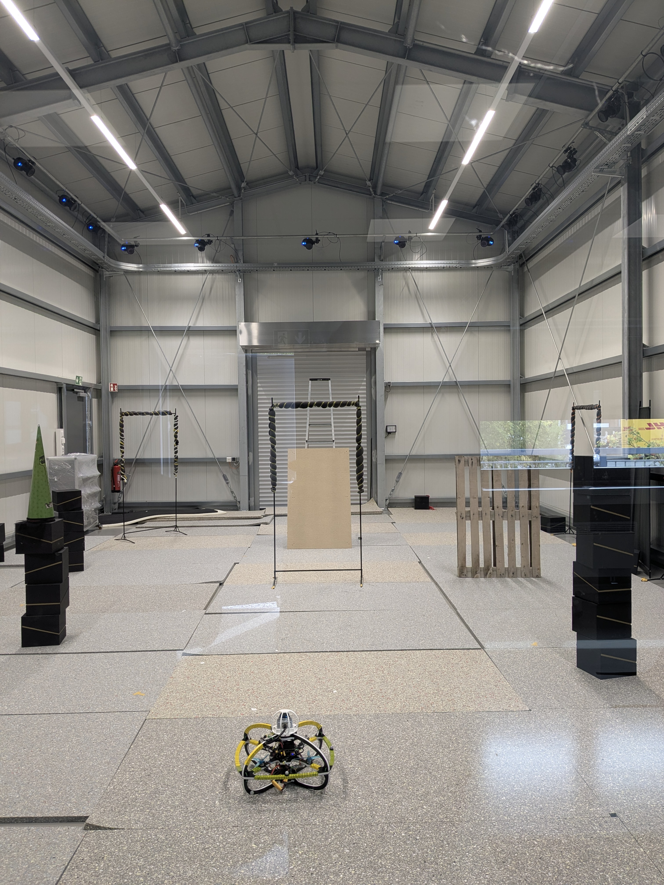 | 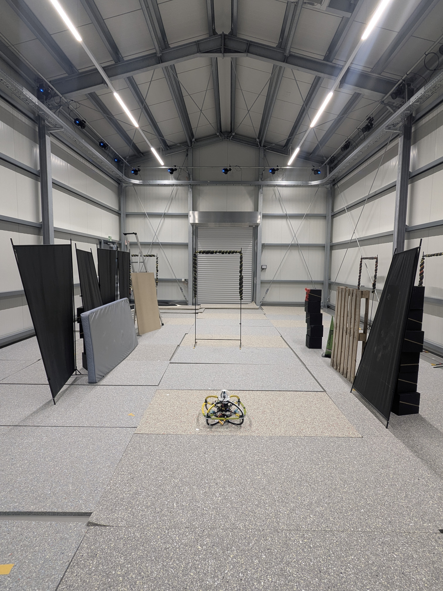 |

Indoor VICON-tracked arena with an obstacle course (rope-frame gates, cones,
a wooden pallet, stacked boxes) — ceiling-mounted VICON cameras visible on
the truss.

### Map reconstruction

<!-- TODO: point cloud map render(s) vs. environment photo, once map export
     is set up (FAST-LIO2's pcd_save_en output and/or GLIM's /tmp/dump map) -->

### Dataset

Two recording sessions, 12 sequences total; **7 kept, 5 dropped** — see
[Data quality](#data-quality-livox-imu-dropout) below for why.

| Sequence | Duration | Status |
|----------|:---:|---|
| batch1_00 | 78.0 s | clean |
| batch1_01 | 20.6 s | dropped — Livox IMU dropout 37% of recording |
| batch1_02 | 39.0 s | dropped — Livox IMU dropout 55% of recording |
| batch1_07 | 64.5 s | clean |
| batch2_01 | 72.3 s | clean |
| batch2_02 | 76.0 s | clean |
| batch2_03 | 62.2 s | clean |
| batch2_04 | 41.8 s | clean |
| batch2_05 | 59.5 s | clean |
| batch2_06 | 69.6 s | dropped — Livox IMU dropout 85% of recording |
| batch2_07 | 49.1 s | dropped — Livox IMU dropout 90% of recording |

All sequences publish `/livox/lidar` (10 Hz, same per-point timestamp fields
as the Mid-360 TIERS data) and `/livox/imu` (200 Hz nominal).

**Ground truth**: `/mavros/local_position/pose` — the Pixhawk EKF's fusion of
VICON pose with onboard IMU/barometer, ~30 Hz. An alternative topic,
`/vicon/drone/drone/pose`, gives pure unfused VICON at ~120 Hz for
cross-checking.

**Startup trim**: the drone sat stationary on the ground for the first ~3.5s
of every recording before takeoff. This period is trimmed from ground truth
and every method's output before evaluation via `scripts/trim_startup.py` —
a plain time-based trim, distinct from `trim_dlio.py`'s zero-position
calibration-artifact trim used for the TIERS dataset.

### Data quality: Livox IMU dropout

Both recording sessions produced sequences where `/livox/imu` intermittently
stopped publishing for hundreds of milliseconds to over a second at a time,
while `/livox/lidar` and every other topic (including the Pixhawk IMU and
both ground-truth sources) stayed completely clean in the same recordings —
isolating the fault to the Livox IMU stream specifically, not a general
system or timing issue. Severity varied sequence to sequence (37–90% of a
recording with no IMU data) and got markedly worse later in each session,
consistent with something that degrades over a recording run (USB bandwidth
contention, thermal throttling, or a driver-side buffer issue) rather than a
one-off glitch. Affected sequences are excluded from the results above;
`/mavros/imu/data` (Pixhawk) stayed clean throughout every sequence,
including the dropped ones, making it a viable fallback IMU source for
recovering them — pending the LiDAR-to-Pixhawk-IMU extrinsic calibration
(see `docs/`).

### Reproducing

```bash
# batch run: all 7 clean sequences x all 4 methods, with GT extraction,
# startup trimming, and evo evaluation
bash scripts/run_drone_batch.sh
```

Or per-method, with the drone dataset's topics/configs:

```bash
python3 scripts/extract_gt.py <bag> --topic /mavros/local_position/pose --out gt_raw.tum
python3 scripts/trim_startup.py gt_raw.tum --out gt.tum --trim 3.5

bash scripts/run_kiss_icp.sh  <bag> /livox/lidar
bash scripts/run_fastlio2.sh  <bag> drone.yaml
bash scripts/run_dlio.sh      <bag> /livox/lidar /livox/imu
bash scripts/run_glim.sh      <bag> configs/glim/config_drone
```

## Platform

Dev (TIERS dataset): Ubuntu 22.04, ROS 2 Humble, x86\_64 (Intel iGPU).
Live drone dataset: Jetson Orin NX (JetPack 6.2, CUDA 12.6), Ubuntu 22.04,
ROS 2 Humble, Livox Mid-360 + Pixhawk — GLIM runs in GPU mode.

## Author

Harsha Reddy
