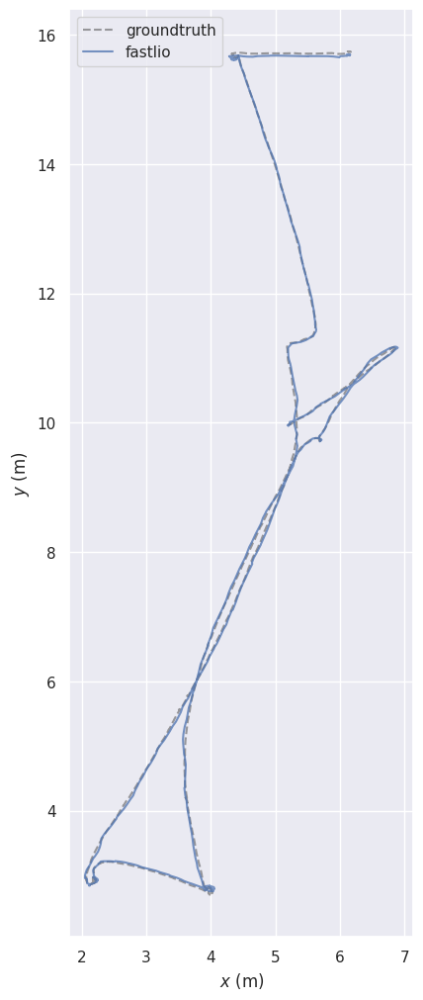
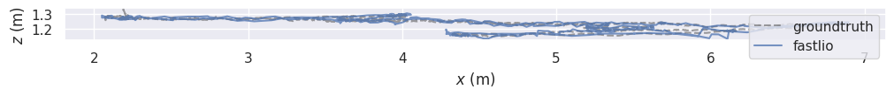

# FAST-LIO2 ROS2 Evaluation Framework for Livox MID360

ROS2 Humble evaluation framework for FAST-LIO2 using Livox MID360 datasets with ground-truth benchmarking via EVO.

## Overview

This project extends and evaluates FAST-LIO2 on Livox MID360 datasets in ROS2 Humble. The work includes:

- MID360 `PointCloud2` support
- ROS1 → ROS2 bag conversion workflow
- Offline SLAM evaluation pipeline
- TUM trajectory export
- EVO-based APE and RPE benchmarking
- Ground-truth comparison using motion-capture data

## Results (IndoorOffice1)

| Metric | Value |
|----------|---------|
| APE Mean | 0.053 m |
| APE RMSE | 0.060 m |
| APE Max | 0.145 m |
| RPE Mean | 0.086 m |
| RPE RMSE | 0.113 m |
| RPE Max | 0.363 m |
| Scale Correction | 1.0 |

Dataset statistics:

- Duration: 66.2 s
- Ground-truth path length: 35.316 m
- Estimated path length: 32.288 m

## Trajectory Comparison

### XY Trajectory (FAST-LIO vs Ground Truth)



### XZ Trajectory (FAST-LIO vs Ground Truth)



## Evaluation Pipeline

```text
ROS1 MID360 Dataset
        │
        ▼
ROS1 → ROS2 Conversion
        │
        ▼
FAST-LIO2 (ROS2 Humble)
        │
        ▼
/Odometry
        │
        ▼
ROS2 Bag Recording
        │
        ▼
TUM Trajectory Extraction
        │
        ▼
EVO Evaluation
        │
        ├── APE (RMSE: 6.0 cm)
        └── RPE (RMSE: 11.3 cm)
```

## Key Modifications

- Removed dependency on `livox_ros_driver2::CustomMsg` for MID360 evaluation
- Added support for `sensor_msgs/msg/PointCloud2`
- Configured ROS2 Humble workflow for offline bag evaluation
- Added EVO-based APE and RPE benchmarking

## Upstream Project

This work is based on the original FAST-LIO project:

- https://github.com/hku-mars/FAST_LIO

and the ROS2 implementation that served as the starting point for these modifications.

## Future Work

- Benchmark against GLIM
- Benchmark against KISS-ICP
- Test additional MID360 datasets
- Investigate online extrinsic calibration
